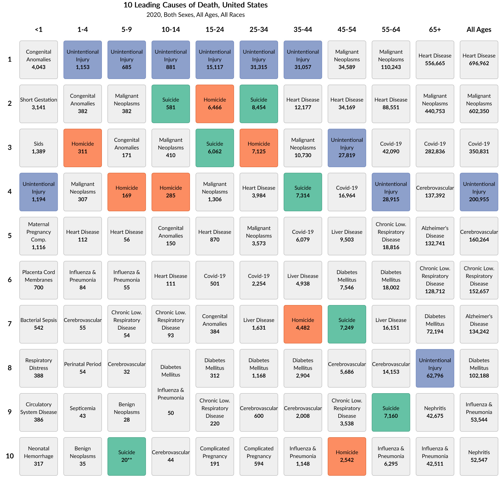

# CDC Mortality and Cars

If you check out [CDC's interactive visualization on leading causes of death by age group](https://wisqars.cdc.gov/data/lcd/home) (or see figure below), you'll see that for ages 1-44, the leading cause of death is "Unintentional Injury". But what exactly are "Unintentional Injury"'s? If you explore the CDC website, you'll see that the  majority of "Unintentional Injury"'s are from motor vehicles. 

This repo separates out deaths from motor vehicles and regraphs the CDC plot. You'll see that cars are one of the most common causes of death for broad swathes of healthy Americans.

Created by [Charles Yang](http://charlesyang.io)
